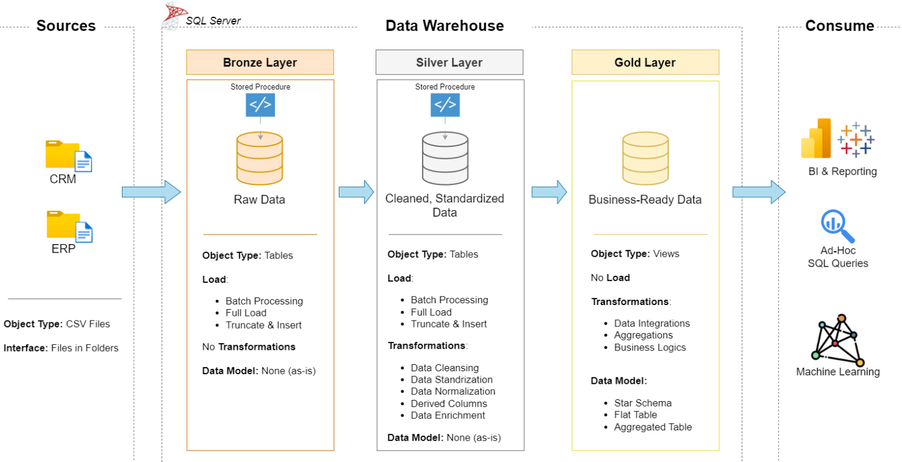
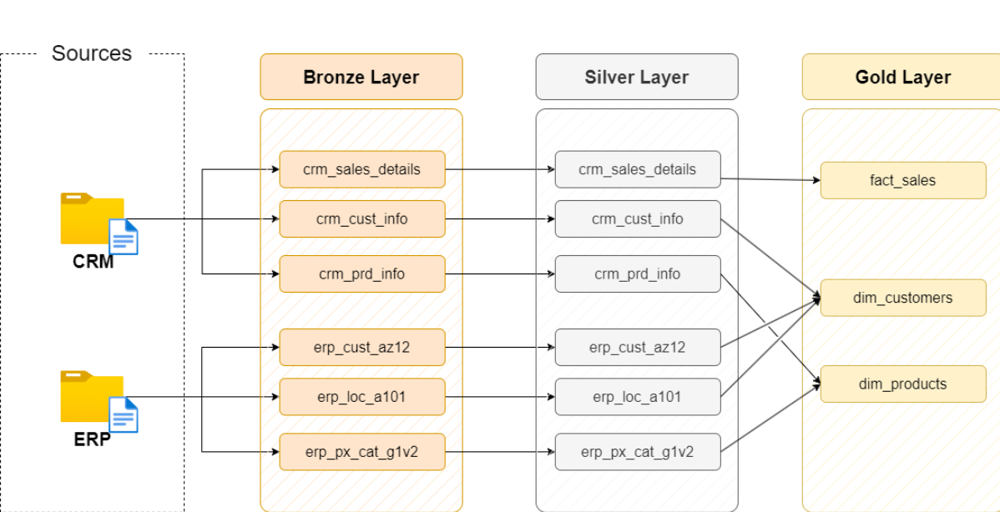
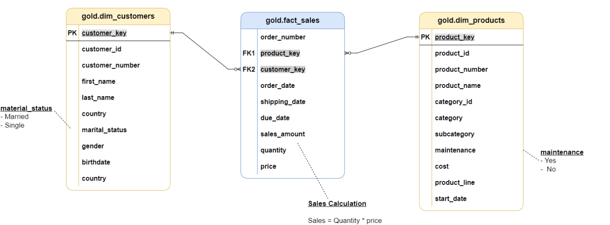

# SQL Data Warehouse Project

A end-to-end data warehouse built on **SQL Server** using the **Medallion Architecture** (Bronze → Silver → Gold). It consolidates sales data from two source systems (CRM and ERP) into a clean, business-ready star schema for analytics and reporting.

---

## Architecture



| Layer | Purpose | Object Type | Load Method | Transformations |
|-------|---------|-------------|-------------|-----------------|
| **Bronze** | Raw data, stored as-is from the source CSV files | Tables | Batch, full load (truncate & insert) | None |
| **Silver** | Cleaned and standardized data | Tables | Batch, full load (truncate & insert) | Cleansing, standardization, normalization, derived columns, enrichment |
| **Gold** | Business-ready data for consumption | Views | No load (views over Silver) | Data integration, aggregations, business logic |

**Consumers:** BI & reporting tools, ad-hoc SQL queries, and machine learning.

---

## Data Flow



**Sources**

- **CRM:** `cust_info`, `prd_info`, `sales_details`
- **ERP:** `CUST_AZ12`, `LOC_A101`, `PX_CAT_G1V2`

**Gold layer outputs**

- `gold.dim_customers`: built from CRM customers + ERP customer and location data
- `gold.dim_products`: built from CRM products + ERP product categories (current products only)
- `gold.fact_sales`: built from CRM sales details, linked to both dimensions

---

## Data Model (Star Schema)



- **`gold.fact_sales`**: one row per sales line (order number, dates, sales amount, quantity, price)
- **`gold.dim_customers`**: customer details (name, country, marital status, gender, birth date)
- **`gold.dim_products`**: product details (name, category, subcategory, cost, product line, start date)

Business rule: `Sales = Quantity × Price`

---

## Key Data Cleaning Steps (Silver Layer)

- Remove duplicate customers, keeping the most recent record
- Trim whitespace and decode codes into readable values (e.g. `M` → `Married`, `F` → `Female`, `R` → `Road`)
- Convert integer dates (`YYYYMMDD`) into real `DATE` values; invalid dates become `NULL`
- Recalculate invalid or missing sales and price values
- Derive product category IDs and product end dates
- Standardize country names (`DE` → `Germany`, `US`/`USA` → `United States`) and fix customer IDs across systems
- Replace future birth dates with `NULL`

---

## Repository Structure

```
.
├── datasets/              # Source CSV files
│   ├── source_crm/        # cust_info, prd_info, sales_details
│   └── source_erp/        # CUST_AZ12, LOC_A101, PX_CAT_G1V2
├── docs/                  # Architecture, data flow and data model diagrams
├── scripts/
│   ├── init_database.sql      # Creates the DataWarehouse database and schemas
│   ├── bronze/                # Bronze DDL + load procedure
│   ├── silver/                # Silver DDL + load procedure
│   ├── gold/                  # Gold views (dimensions and fact)
│   ├── EDA.sql                # Exploratory data analysis
│   └── Advanced_analytics.sql # Advanced analytics and reporting views
├── tests/                 # Data quality tests
├── LICENSE
└── README.md
```

---

## Getting Started

### Prerequisites

- SQL Server (any recent version)
- A SQL client such as SQL Server Management Studio, Azure Data Studio, or DBeaver

### Setup

Run the scripts in this order:

1. **Initialize the database and schemas**
   `scripts/init_database.sql`

   > ⚠️ This drops and recreates the `DataWarehouse` database if it already exists. All existing data will be lost.

2. **Create the Bronze tables**
   `scripts/bronze/DDL_bronze.sql`

3. **Create the Bronze load procedure**
   `scripts/bronze/proc_load_bronze.sql`

4. **Create the Silver tables**
   `scripts/silver/DDL_silver.sql`

5. **Create the Silver load procedure**
   `scripts/silver/proc_load_silver.sql`

6. **Create the Gold views**
   `scripts/gold/ddl_gold.sql`

7. **Load the data**
   ```sql
   EXEC bronze.load_bronze;
   EXEC silver.load_silver;
   ```

> **Note:** `proc_load_bronze.sql` uses `BULK INSERT` with absolute file paths. Update the paths to point to the `datasets/` folder on your machine before running it.

---

## Analytics

### Exploratory Data Analysis (`scripts/EDA.sql`)

- Database exploration (tables and columns)
- Dimensions exploration (countries, categories, product lines)
- Date exploration (order date range, customer ages)
- Measures exploration (total sales, quantity, orders, customers, products)
- Magnitude analysis (customers by country and gender, revenue by category)
- Ranking analysis (top and bottom 5 products by revenue)

### Advanced Analytics (`scripts/Advanced_analytics.sql`)

- Changes over time: yearly and monthly sales trends
- Cumulative analysis: running totals
- Performance analysis: product sales vs. average and vs. previous year
- Part-to-whole analysis: category contribution to total sales
- Data segmentation: product cost ranges and customer segments (VIP / Regular / New)

### Reporting Views

| View | Description |
|------|-------------|
| `gold.report_customers` | Customer KPIs: age group, segment, recency, total orders, sales, average order value, average monthly spend |
| `gold.report_products` | Product KPIs: performance segment, recency, total orders, sales, customers, average selling price, average monthly revenue |

---

## License

This project is licensed under the terms of the [LICENSE](LICENSE) file.
